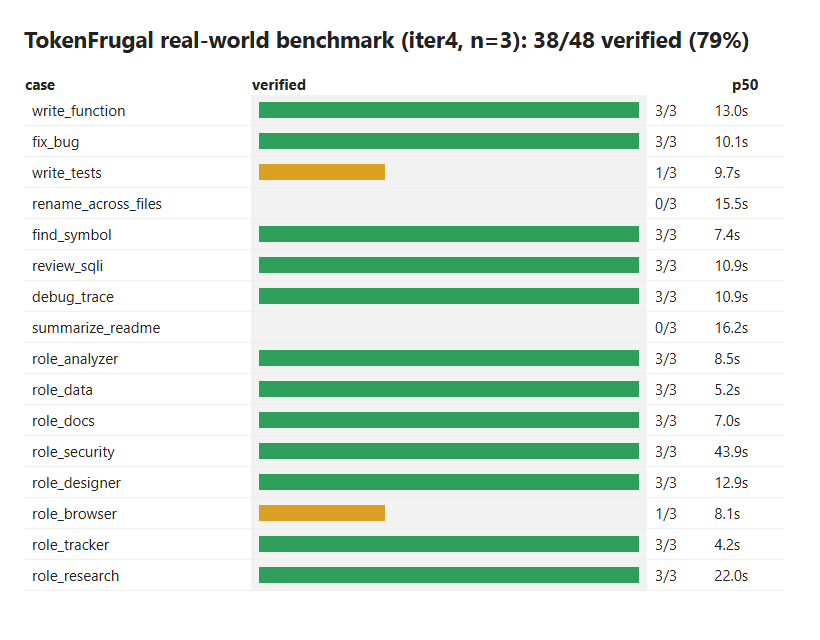

# TokenFrugal benchmark results (iteration 4, n=3 per case, all 11 roles)

Every case is verified by running the produced code or inspecting the files, not by trusting the model's "done" report.
Models: builder `qwen2.5-coder-yarn:3b`, thinker `llama3.2:3b-16k`. Raw data: `bench/20261009-192407-iter4.md/.json`.

| Case | Role | Verified | Typical time |
| --- | --- | --- | --- |
| write_function | builder | 3/3 | 12-21s |
| fix_bug | builder | 3/3 | 10-11s |
| write_tests | builder | 1/3 | 10s |
| rename_across_files | builder | 0/3 | 13-36s |
| find_symbol (synaptree) | builder | 3/3 | 7s |
| review_sqli | reviewer | 3/3 | 10-16s |
| debug_trace | debugger | 3/3 | 11s |
| summarize_readme | docs | 0/3 | 16s |
| role_analyzer | analyzer | 3/3 | 9s |
| role_data | data | 3/3 | 5-11s |
| role_docs | docs | 3/3 | 7-14s |
| role_security | security | 3/3 | 42-46s |
| role_designer | designer | 3/3 | 13s |
| role_browser | browser | 1/3 | 8-10s |
| role_tracker | tracker | 3/3 | 4s |
| role_research | research | 3/3 | 22s |

**Total: 38/48 verified (79%). Every role ran to completion in every run (48/48); no tool-call timeouts.**

## Where it performs well
Single-file edits and creation (write_function, fix_bug), code lookup through the code graph, review and debugging of small files, and every
tool-backed role (data, security, designer, tracker, research, analyzer). These finish in 4-46s, with only a short summary returned to the cloud agent.

## Where it fails (model quality, not gateway bugs)
- **rename_across_files 0/3**: the 3B builder renames the definition and import but leaves the call `old_name(1)`. A prompt nudge to re-read the file did not help (tried, reverted).
- **write_tests 1/3**: tests call methods that don't exist or assert wrong values.
- **summarize_readme 0/3**: the thinker produces a fluent but wrong summary (hallucinated project description) despite reading the file.
- **role_browser 1/3**: navigation works, but the model often skips the snapshot and does not report the page heading.

## Gateway bugs found and fixed in this pass
String-typed tool args, JSON tool calls written as text (fenced/truncated), "all tool calls failed" accepted as success, `Error:` tool output not treated as failure,
browser `filePath` writes denied, missing-import code (now linted and fed back), and model refusals (now retried as slop). No open gateway-level bug remains in this run.

## Does it solve the problem?
Partly, honestly. For routine, well-scoped, single-file work and tool lookups it saves cloud tokens and is mostly correct. For multi-file edits, test authoring,
summarization and browsing, a 3B model is unreliable: the orchestrator must verify results (run tests, git diff) and fall back to Haiku, as the project rules already require.
Screenshot below is rendered from the raw JSON by `make_report.py` (HTML captured with headless Edge; no extra software installed).

Interactive version of the 3B results table, sortable and filterable by role: [results-3b.html](results-3b.html)
