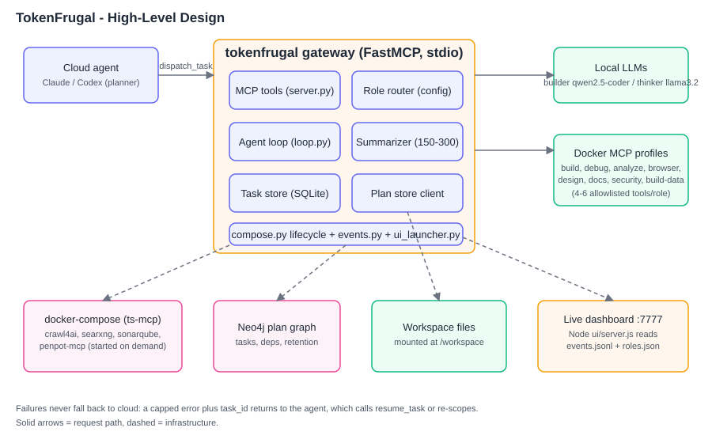
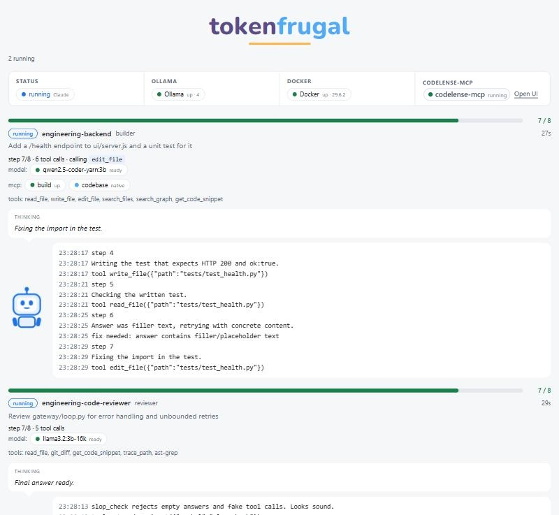

<p align="center"></p>

# TokenFrugal

**Stop burning your Claude Code / Codex token quota on boilerplate. TokenFrugal hands routine coding, tests, docs, reviews and research to a free local LLM (Ollama or any OpenAI-compatible API) through one small MCP server, and keeps your paid cloud model for architecture and hard decisions.**

Keywords: MCP server, Model Context Protocol, local LLM, Ollama, token saving, reduce Claude Code usage, Codex, LM Studio, vLLM, agent personas, Docker MCP gateway, offline coding assistant.

## The problem it solves

Corporate or entry-level AI subscriptions hit their limits fast. Most of those tokens go to routine work: boilerplate, tests, docstrings, lint fixes, summaries, log reading. A laptop with a GPU (or an Apple Silicon Mac) can do that work for free, but wiring a local model, tools and agents together is tedious.

TokenFrugal does the wiring:

- Your cloud agent calls one tool, `dispatch_task(agent, task)`, and gets back a 150-300 token summary instead of pages of output.
- A local model does the work with a small allowlisted toolset (4-6 tools per role) so small models stay on track.
- 282 [agency-agents](https://github.com/msitarzewski/agency-agents) personas are mapped to 11 roles (builder, analyzer, reviewer, security, docs, designer, browser, research, data, debugger, tracker).
- Failures return a short error and a `task_id` (`resume_task`). No silent cloud fallback, so no surprise spend.

For companies this means a cheaper setup: standard-tier cloud subscriptions are enough because the cloud model only plans and reviews, while the bulk of the work runs on a local LLM hosted on a modest, inexpensive GPU (a 3B-class model fits in a few GB of VRAM) that is sized to deliver exactly what routine tasks need and no more.

Good fit: side projects, college projects, corporate seats with tight quotas, laptops with a GPU or Apple Silicon.

## Requirements

| Need | Notes |
| --- | --- |
| Python 3.11+ and git | |
| Docker (Desktop, Engine, Colima, Rancher Desktop or Podman with a `docker` shim) | Runs the tool backends. Docker Desktop is free only for personal/education/small-business use; check its licence for your company. |
| Ollama **or any OpenAI-compatible LLM API** | Host and port set in `.env` (`TOKENFRUGAL_LLM_URL`). Default `http://localhost:11434/v1`. |
| Two local models | Pull the bases, then create the tuned tags the gateway expects (`qwen2.5-coder-yarn:3b`, `llama3.2:3b-16k`; see `gateway/personas.yaml`):<br>`ollama pull qwen2.5-coder:3b` / `ollama pull llama3.2:3b`<br>`ollama create qwen2.5-coder-yarn:3b -f models/builder.Modelfile`<br>`ollama create llama3.2:3b-16k -f models/thinker.Modelfile` |
| An MCP-capable agent | Claude Code, Codex, Cursor or any MCP client. |

Check everything at once: `python scripts/doctor.py` (installs nothing; prints exact fix commands).

## Install (Windows, macOS, Linux)

```bash
git clone https://github.com/maxh8086/tokenfrugal.git
cd tokenfrugal
python -m venv .venv
# Windows: .venv\Scripts\activate     macOS/Linux: source .venv/bin/activate
pip install -r requirements.txt
cp .env.example .env          # set TOKENFRUGAL_LLM_URL (host:port) for your LLM
python scripts/doctor.py
```

Then, once:

1. **Start backends** (creates secrets in `~/.docker/mcp/mcp.env`, outside the repo): `scripts/mcp_up.sh` (macOS/Linux) or `scripts/mcp_up.ps1` (Windows). Helper images that wrap upstream tools are built from the Dockerfiles in `docker/` on first use and reused afterwards.
2. **Install the tool profiles** (build, build-data, analyze, security, debug, docs, design, browser) into Docker's MCP Toolkit:
   ```bash
   python scripts/install_profiles.py          # mounts CC_WORKSPACE from .env, else this repo; --workspace PATH to override
   ```
   Set `CC_WORKSPACE` in `.env` to the same absolute path. Re-run it any time to refresh the profiles.
3. **Security role only (SonarQube):** open http://localhost:9100, log in as `admin` / `admin` and set a new password, then *My Account -> Security -> Generate Token* (type: User). Put the token in `~/.docker/mcp/mcp.env` as `SONARQUBE_TOKEN=...` (`SONARQUBE_ORG` is only needed for SonarCloud; leave it empty for the local server). If your secrets file lives elsewhere, set `MCP_ENV_FILE=<path>` in `.env` (or the environment); the gateway and `docker-compose.yml` both read that path instead. Then check it with `python scripts/smoke.py security`.
4. **Smoke tests:** `python scripts/smoke.py` runs one tiny task per role (needs Ollama and the steps above); `python -m scripts.smoke_plan` exercises the Neo4j plan store (prune, checkpoint, dependency guard) with throwaway data.

Register with your agent (stdio):

```json
{ "mcpServers": { "tokenfrugal": { "type": "stdio", "command": "python", "args": ["-m", "gateway.server"], "cwd": "<path-to>/tokenfrugal" } } }
```

For Codex use the equivalent `[mcp_servers.tokenfrugal]` table in `~/.codex/config.toml`.

## Use

Ask your agent: "use tokenfrugal to write unit tests for `utils.py`". Tools: `dispatch_task`, `ask_followup`, `get_detail`, `resume_task`, `list_roles`, plus plan tools (`plan_add`, `plan_overview`, ...) backed by Neo4j with automatic retention (`PLAN_RETENTION_DAYS`). `server.py` is a simpler two-tool server if you only want `query_local_llm`.

## Adding MCP servers

**Recommended: the Docker MCP gateway with servers from the Docker MCP Toolkit catalogue.** Most MCP servers you will want (filesystem, git, fetch, browser, search, databases, ...) already exist in the catalogue as maintained, sandboxed containers. TokenFrugal runs each role through `docker mcp gateway run --profile <name>`, so adding one is a profile edit, not new code:

1. Add the catalogue server to a profile in `profiles/*.yaml` (or pick it with `docker mcp` / Docker Desktop's MCP Toolkit).
2. Allowlist 4-6 of its tools for the role in `gateway/personas.yaml`; small local models do better with few tools.
3. Run `python scripts/install_profiles.py` to import the profiles, then restart the gateway.

**Servers that are not in the catalogue** are shipped with TokenFrugal rather than left to you. Two routes, both already used in this repo:

- **Containerised helper:** a Dockerfile in `docker/` wraps the upstream tool (for example `tokenfrugal/chrome-devtools-mcp:1`, `tokenfrugal/penpot-mcp:1`), and `docker-compose.yml` (project `ts-mcp`) starts it on demand for the roles that list it under `compose:`.
- **Native stdio server:** a role can list a local stdio MCP server under `native:` in `gateway/personas.yaml` when it cannot run in Docker.

**When you need a new MCP server,** ask Claude Code or Codex to add it. Point it at this README and `CLAUDE.md`: it should check the Docker MCP catalogue first, fall back to a helper image or native server only if the catalogue has nothing, update the profile and `personas.yaml`, and re-run `scripts/install_profiles.py`. The dashboard then shows the new server on the agent card and logs each call as it happens.

### Building helper images from a pinned upstream commit

If you prefer to build from source at an exact commit instead of the npm package, `docker/pins.yaml` lists each upstream (`repo`, full 40-char `sha`, `image` tag, `dockerfile`). The helper fetches only that commit, checks that `HEAD` equals the pin, builds the image, and deletes the clone:

```bash
python scripts/pinned_build.py                      # all pins
python scripts/pinned_build.py chrome-devtools-mcp  # one pin; --keep leaves the clone for inspection
```

To bump a pin, change `sha` (resolve it with `git ls-remote --tags <repo>`), rebuild, and re-run the smoke tests.

A weekly GitHub Actions job (`.github/workflows/bump-pins.yml`, also runnable by hand) runs `scripts/check_pins.py`, which looks for newer release tags and opens a pull request that moves the pin. Nothing changes until you merge it; run `python scripts/pinned_build.py` first to confirm the image still builds.

## Architecture



- [High-level design](docs/hld.svg): cloud agent, gateway, local LLMs, Docker MCP profiles, Neo4j, dashboard
- [Low-level design: modules](docs/lld-modules.svg)
- [Low-level design: dispatch_task sequence](docs/lld-sequence.svg)
- [Full write-up](docs/architecture.md)

## FAQ

**Does it send my code to the cloud?** Local models run on your machine; only the short summaries return to your cloud agent.
**Can the small models really code?** For scoped, well-specified tasks yes; that is why tool allowlists and step limits exist. Keep architecture in the cloud model.
**Windows/macOS/Linux?** All three; only git, Docker and Python are called.

## Credits and licence

Apache-2.0 (see [LICENSE](LICENSE), [NOTICE](NOTICE)). Inspired by and built on the work of many authors; see [CREDITS.md](CREDITS.md). Third-party backends run as their own unmodified containers under their own licences.

Developed by Vaibhav Pavtekar with AI assistance (Claude Code).

## Live dashboard



The dashboard starts with the gateway and opens in your browser at http://127.0.0.1:7777 (configurable, see below). At the top is a two-row status table: Status (idle, running, disconnected or unavailable, plus which client is connected: Claude, Codex or both), Ollama, Model and Agent on the first row; Docker (one third) and the MCP servers of the selected role (two thirds) on the second. Below it are the running tasks, a thinking box and a log, with a character that works while a task runs and sleeps when idle. If another gateway already serves the port, it is reused.

- A **Tokens saved** counter sits below the animated character: the running total, per task (failed ones too, since the local work still ran), of the tokens the local model handled (prompts, tool output, its own text; estimated at 4 characters per token) minus the short summary returned to your cloud agent. The label is `tokens_saved` in `gateway/ui.yaml`.
- `TOKENFRUGAL_UI=0` disables it, `TOKENFRUGAL_UI_OPEN=0` skips the browser pop-up, the port is `port:` in `gateway/ui.yaml` (default 7777); the `UI_PORT` environment variable overrides it.
- The dashboard is the gateway's built-in MCP channel: every MCP call a local agent makes (tool name, arguments, step) is recorded as an event the moment it happens, and each agent card shows the MCP servers of its role with live status, the current tool, and a log of every call.
- The fourth top box shows synaptree-mcp (the code graph UI, http://127.0.0.1:8787/ui/): `running` becomes a link that opens its UI in a new tab, otherwise `unavailable`. The ports probed are `synaptree_ports` in `gateway/ui.yaml` (default 8787, probed via `/healthz`).
- All dashboard text comes from `gateway/ui.yaml`; roles, models and tools come from `gateway/roles.json`.
- Needs Node 18+ (no npm packages); without Node the gateway runs as before. `node ui/server.js` starts it by hand.
- The gateway writes `gateway/events.jsonl` and `gateway/roles.json`; override with `GATEWAY_EVENTS`. Restart the gateway after updating so it emits events.
