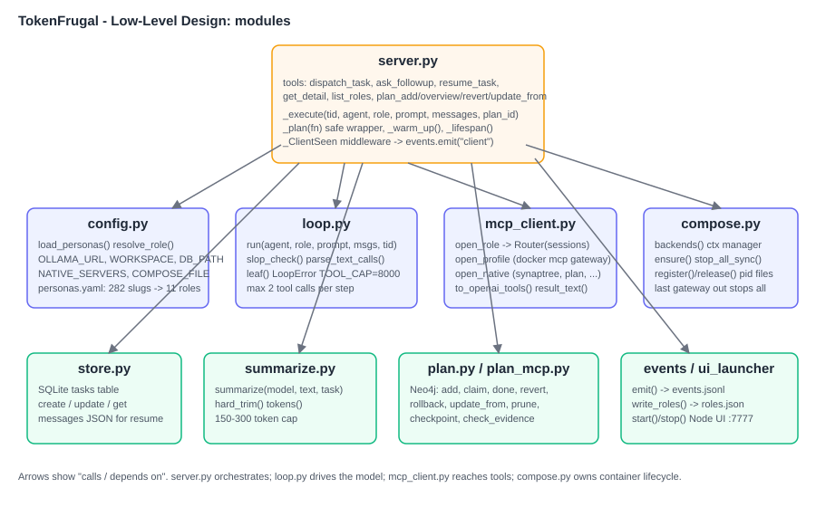
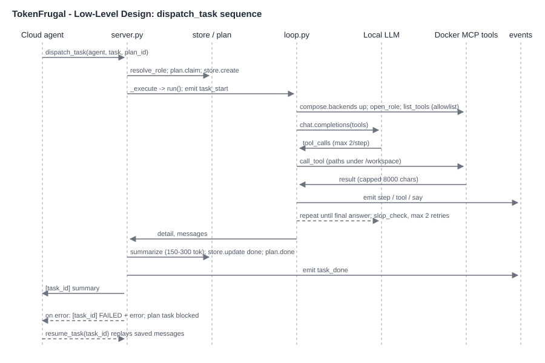

# TokenFrugal architecture

## High-level design

A cloud agent (Claude, Codex) plans and calls the gateway's MCP tools. The gateway routes each task by persona to a role (builder or thinker), runs a bounded tool-calling loop against a local LLM, reaches tools through Docker MCP profiles, and returns a 150-300 token summary. Full output stays in the SQLite task store and is fetched on demand with `get_detail`. Failures never fall back to the cloud: the agent gets a capped error and a `task_id` to pass to `resume_task`.

## Low-level design

### Modules

| Module | Responsibility |
| :--- | :--- |
| `gateway/server.py` | FastMCP tools, lifespan (UI, compose, Neo4j warm-up), `_execute` pipeline |
| `gateway/config.py` | Env config, `personas.yaml` loading, `resolve_role` |
| `gateway/loop.py` | Bounded agent loop, slop checks, text tool-call recovery |
| `gateway/mcp_client.py` | Docker profile and native MCP sessions behind one `Router` |
| `gateway/compose.py` | On-demand backend containers, last-gateway-out shutdown |
| `gateway/store.py` | SQLite task persistence for follow-ups and resume |
| `gateway/summarize.py` | Summary capped at 150-300 tokens |
| `gateway/plan.py`, `plan_mcp.py` | Neo4j plan graph and its MCP surface |
| `gateway/events.py`, `ui_launcher.py`, `ui/` | Event log and the live dashboard on port 7777 |

### dispatch_task sequence

